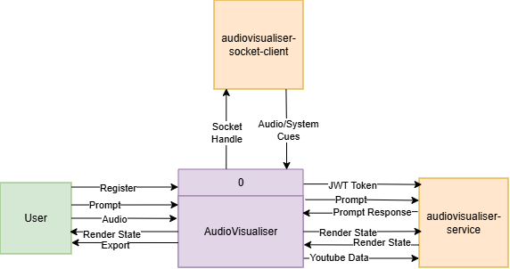
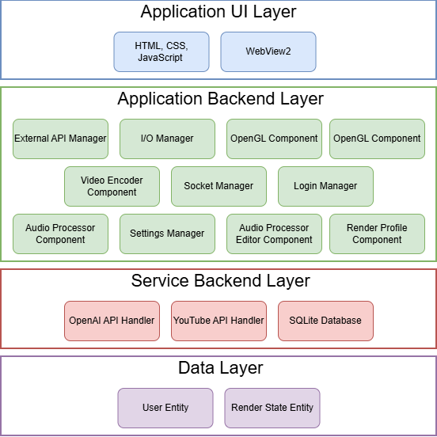
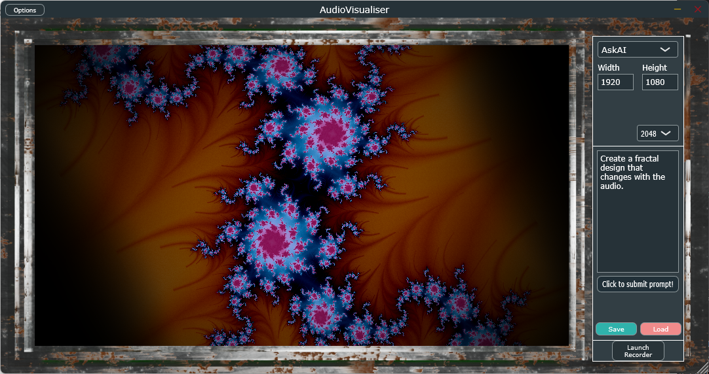
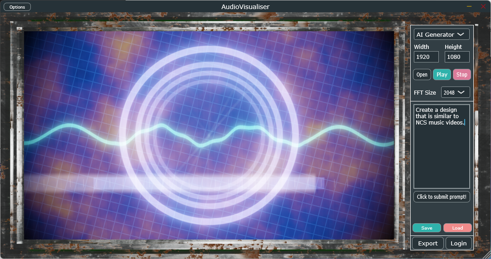
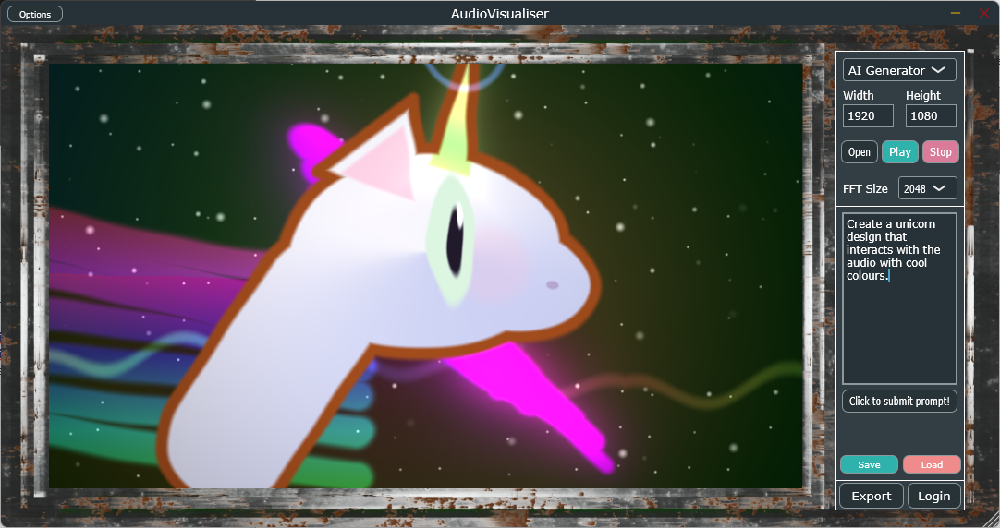
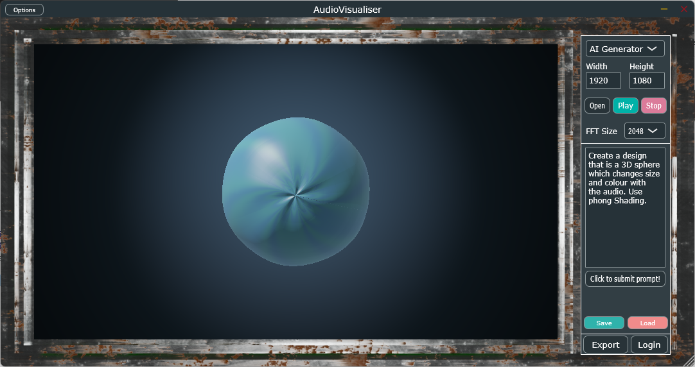
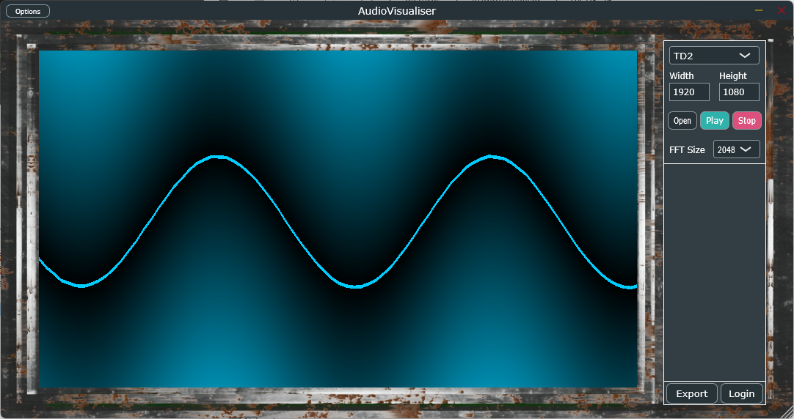

# AudioVisualiser
A Standalone and VST3-compatible real-time audio visualisation SaaS application to visualize audio in real time as 2D and 3D graphical animations.


## Features
* Real-time rendering pipeline using the JUCE C++ framework and OpenGL.
* Created a WebView HTML, CSS, JavaScript UI layer integrated with the native C++ application backend.
* Java Spring Boot RESTful API backend tested with Postman and the Spring Security Test package (JUnit5).
* SQLite CRUD endpoints for managing application and user data.
* Ffmpeg C library is used for GPU accelerated file streaming, multiplexing, and format handling.
  * Frames are transfered from the OpenGL context to ffmpeg's nvenc_264 encoder using CUDA.
* OpenAI API is integrated to generate procedural visual outputs that react with audio input.
* A maintained Agile workflow through GitHub Issues and a Github Project in this repository.

## System
### Context Diagram

### Architecture Diagram


## Build
This project uses **CMake** and **CPM** (CMake Package Manager) to automatically handle dependencies.
### Prerequisites
* **Nvenc and CUDA compatible GPU** (Required for encoding frames to video)
* **NVIDIA GPU Computing Toolkit**
  ```powershell
  winget install -e --id Nvidia.CUDA OR choco install cuda
* **Visual Studio 2026**
* **CMake 3.24+**

### Build with CMake
1. **Clone the repository**
   ```powershell
   git clone https://github.com/iLucaH/AudioVisualiser.git
   cd AudioVisualiser
2. **Run the build script**
   ```powershell
   cmake -B build -G "Visual Studio 18 2026"
3. **Open the Visual Studio solution**
   ```powershell
   build/AudioVisualiser.slnx
4. **Build from Visual Studio in release mode**
### Build with Projucer
1. **Clone the repository**
   ```powershell
   git clone https://github.com/iLucaH/AudioVisualiser.git
   cd AudioVisualiser
2. **Change exporter settings in Projucer to match your system**
3. **Save and run in projucer**

## Gallery





